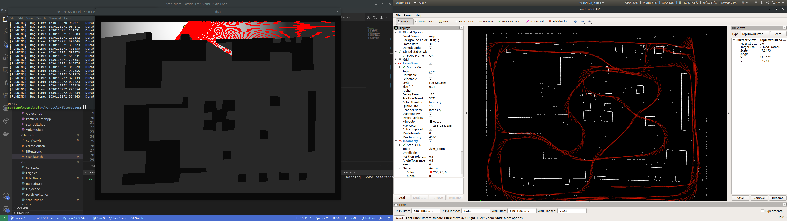
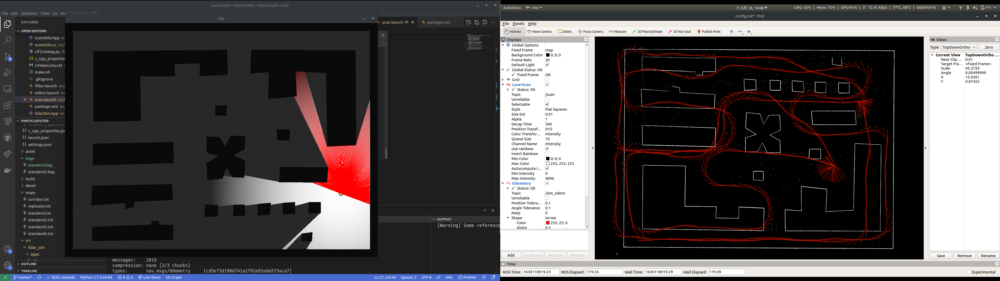
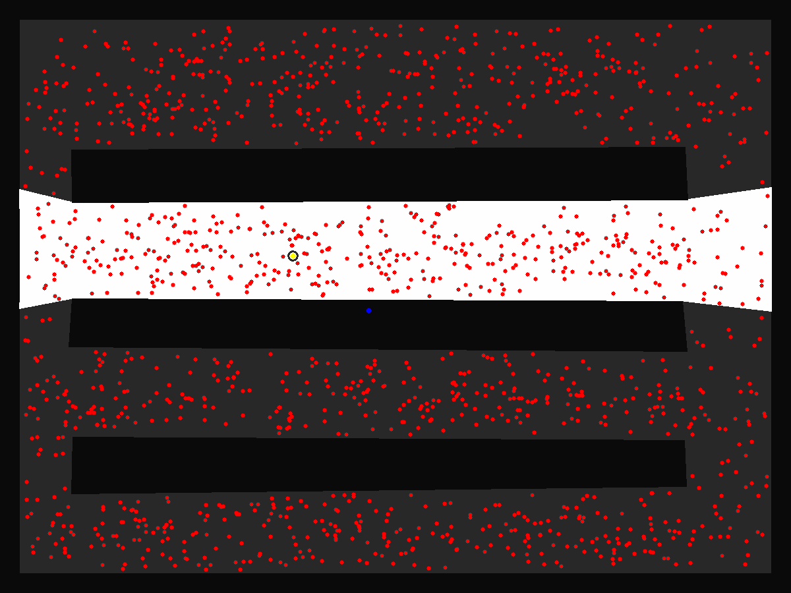
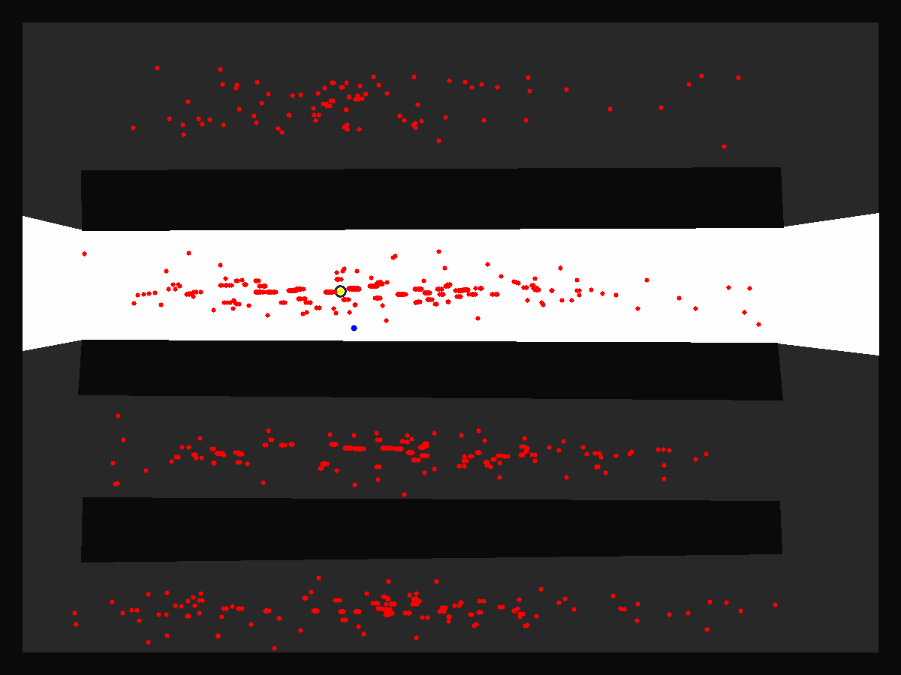
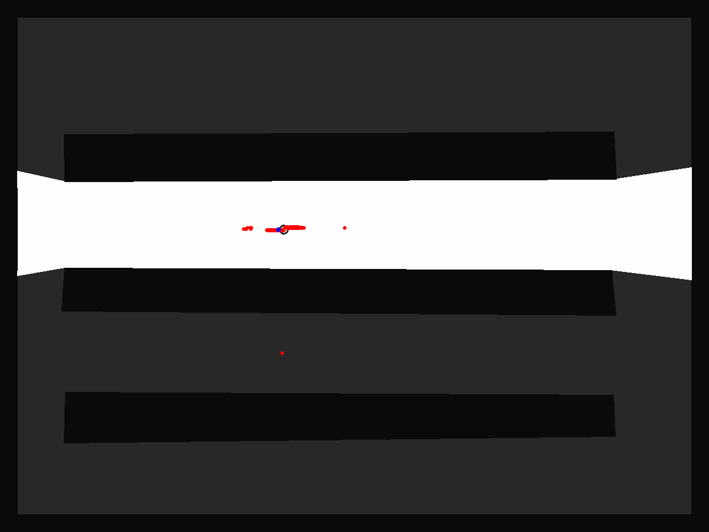
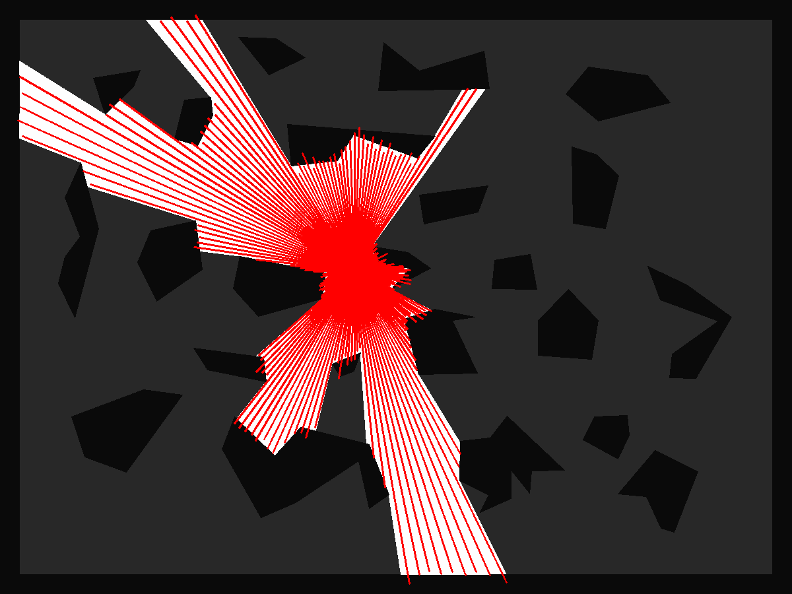

# 2D LiDAR Simulator V 1

---

2D LiDAR Simulator V 1🎇 is built upon the repository🎉🎉: [Github🔗: Enigamtisms/Volume](https://github.com/Enigmatisms/Volume). This simulator contains: 

- **map editor**🎛 (with which you can build your own map)
- **ROS integration**🚀:
  - rosbag generation without publishing
  - rviz visualization for LaserScan, tf, Odometry (perturbed)
  - Direct message publishing
- **Easy-to-use**👌 roslaunch **parameter setting**🗝 for simulated LiDAR and other perimeter settings.
- Fluent opencv-based **keyboard / mouse control / joystick control**⌨🖱 with **high FPS**⏲, visualizing free space and scan.
- **Other sensors:** **Odometry** (`nav_msgs::Odometry`) and IMU (`sensor_msgs::Imu`) output are supported. Ground truth tf is also published.
- **<u>Trajectory saving</u>**. Manually running the simulator could be annoying, yet once the trajectory created by the user is saved, you can run the same trajectory with different LiDAR and odometry settings automatically.

Some demo pictures are shown as follows:





---

## Dependencies

The implementations are done in Ubuntu 18.04 (partially 20.04, therefore both can be used), under some of the key libraries:

| Library name    | Version                                                      |
| --------------- | ------------------------------------------------------------ |
| ROS             | Melodic (for Ubuntu 18.04) and Noetic (for Ubuntu 20.04) are tested |
| OpenCV          | 3.x.x or above, 4.+ recommended                              |
| Eigen           | Usually bond with ROS                                        |
| CUDA (Optional) | To enable particle filter, one can use CUDA 10.2 (with eigen 3.3.4) or CUDA 11+ with (eigen 3.4.0+) |

For compilation, C++ 17 standards are recommended.

---

## Download & Compile

In the repository [Enigmatisms/LiDAR2DSim](https://github.com/Enigmatisms/LiDARSim2D), click clone would suffice.

```shell
git clone git@github.com:Enigmatisms/LiDARSim2D.git
cd LiDARSim2D
```

Usually, for a ROS package we can compile the code via `catkin_make`. Yet, sometimes we want to compile A debug version, i.e. `-DCMAKE_BUILD_TYPE=DEBUG` and a release version at the same time for debugging convenience, therefore, `catkin_make` might not be quick to use. I have written a shell script named `make.sh` in the root directory, you can thereby run:

```shell
sudo chmod +x ./make.sh
./make.sh <thread num for compilation> <if not empty, DCMAKE_BUILD_TYPE=DEBUG>
```

This script receives two params (the second one is optional). The former one declares the number of thread for compilation and the latter one is for debug mode specification. `make.sh` is simply an encapsulation of `catkin_make`.

Notice that if debug mode is on, cmake files will be output to folder `build_debug`, `devel`  thereby contains the executable file of the most recent compilation (regardless of compilation mode `DCMAKE_BUILD_TYPE`)

---

## Run

Before run any of the code, make sure to:

```shell
$ ~/LiDAR2DSim: source devel/setup.bash
```

Otherwise, ROS package `lidar_sim` will not be found.

### 1. The Editor

​		Map editor is for the people who want to create their own maps. Run:

```shell
roslaunch lidar_sim editor.launch
```

​		You can find the param settings in `src/lidar_sim/launch/editor.launch`

- map_name: specified output file name in folder `maps` ( `maps` is in the root directory)

​		There are some other things to be noticed:

- The outer boundaries are given (30-pixel-thin), therefore don't draw anything in the border.
- Objects (Obstacles) are **directional** (all the points of each any one of the obstacles should be drawn in a anti-clockwise way)
- **<u>Press left button of the mouse</u>** to add a new point.
- **<u>Press `E`</u>** if one obstacle is drawn, and it will automatically enclose itself.
- **<u>Press `S`</u>** to save the map and quit.
- **<u>Press `P`</u>** to pop the points added, if the new points are empty, the enclosed objects will be popped.
- **<u>Press `ESC`</u>** to exit without saving the map.

### 2. Particle filter

This repository is once a repo for **<u>Particle filter</u>**, I implemented one simple particle filter for localization purposes. Therefore you can play with it.

This particle filter includes a **2D LiDAR simulator**, which is based on the **Volume2D Shader of mine**[[Github Repo: Enigmatisms/Volume\]](https://github.com/Enigmatisms/Volume). Using this LiDAR simulator, I implemented an interesting little localization program via **Particle Filter**. The localization experiments are only done in a 2D-2DoF (translation position x and y) problem.

 Under the condition of 2000 particles, the FPS of this algorithm is about 16-50 hz, and the convergence is fast and accurate. Run:

```shell
roslaunch lidar_sim filter.launch
```

To find out.

|                     |                        |
| :------------------------------------: | :----------------------------------------: |
| Long-corridor problem intial condition |      Long-corridor problem 4-th move       |
|                    |                        |
|    Long-corridor problem 15-th move    | LiDAR simulator (with noise) visualization |

### 3. Scan simulator

The main content of this repo. Run:

```shell
roslaunch lidar_sim scan.launch
```

On initialization, two new windows will pop up:

- An opencv window for free space, LiDAR scan visualization and scanner controlling.
- An rviz window for sensor_msgs / nav_msgs visualization

Check the launch file, you can find **<u>a lot of</u>** params.

- Controller settings:
  - trans_speed: translation speed (pixel per move, which is 2cm per move)
  - rot_vel: rotation velocity, in degree, which is only available in keyboard control
  - init_x, init_y: initial position of the scanner
  - kp, ki, kd: PID parameters for mouse controller, which allows smooth control.
- LiDAR settings
  - angle_min, angle_max: angle range in rad
  - angle_incre: angle resolution (increment) in rad
  - lidar_noise: noise level (gaussian sigma) for the noise in **<u>range.</u>**
  - lidar_fps: frame rate of LiDAR
- Odometry settings: for nav_msgs::Odometry publishing
  - translation_noise: translation noise level
  - rotation_noise: rotation noise level (both gaussian)
- other settings:
  - map_name: which map to run
  - bag_name: the name of output rosbag
  - skip_selection: if true, the program will not ask you to select the initial position of the scanner, (init_x, init_y) will come into use.
  - direct_pub: publish the ROS messages in the program 
